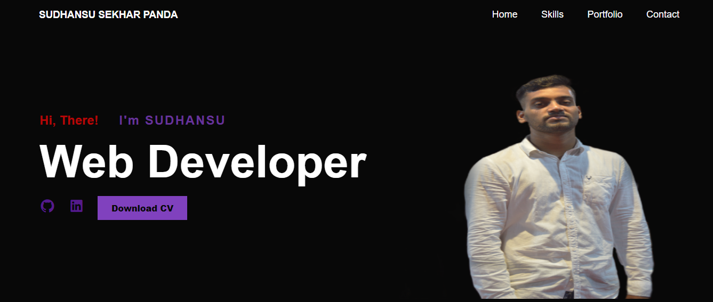
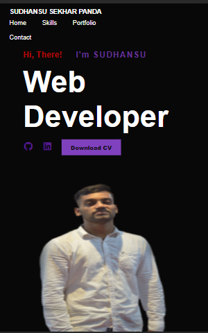
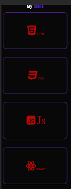
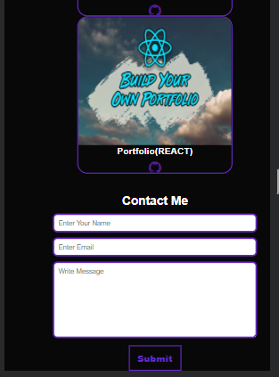

# Project Title

It My Personal Portfolio WebApp.
You can download My CV .

## Screenshots









## Demo

https://codersid063.github.io/Portfolio-Js/

## Tech Stack

**Client:** 

## Run Locally

Clone the project

```bash
  git clone https://github.com/CoderSid063/Portfolio-Js.git
```

## Badges

Add badges from somewhere like: [shields.io](https://shields.io/)

[](https://choosealicense.com/licenses/mit/)
[](https://opensource.org/licenses/)
[](http://www.gnu.org/licenses/agpl-3.0)
